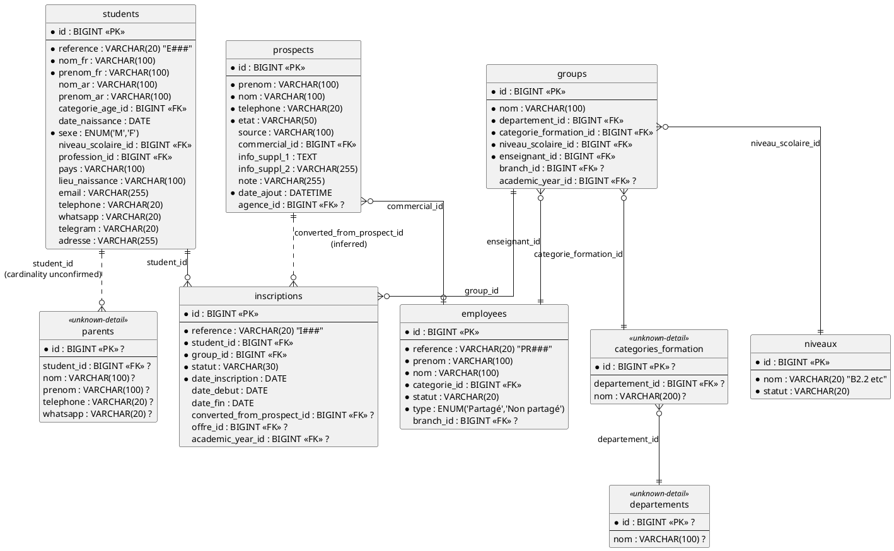
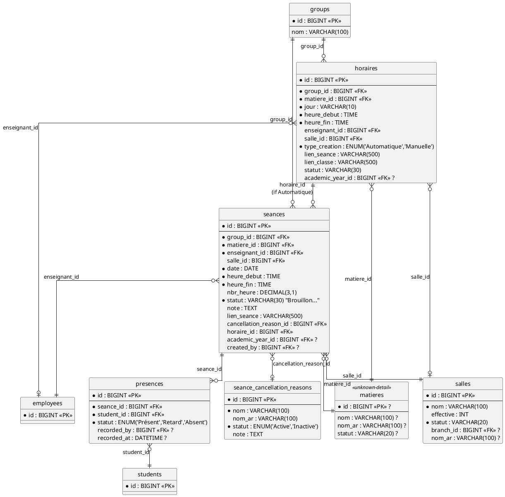
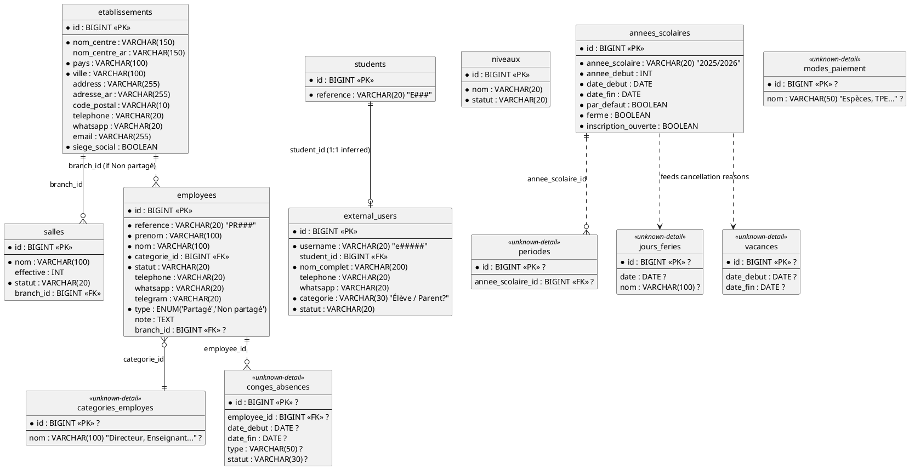

# WimSchool CRM — PlantUML Entity Diagrams

Companion diagrams for `database-schema.md`. Split into 4 domain diagrams (one giant diagram with all 26 tables is unreadable) — paste any block into [plantuml.com/plantuml](https://www.plantuml.com/plantuml) or a PlantUML IDE extension to render.

Legend used in every diagram:
- `PK` = primary key, `FK` = foreign key
- Fields marked `?` are **Strongly Inferred** (not directly labeled in a screenshot, required by the workflow)
- Entities with a dashed border are **Unknown-detail** tables (existence confirmed, own columns not confirmed)
- `--` = confirmed relationship, `..` = inferred relationship

---

## Diagram 1 — Core: Leads, Enrollment, Students, Groups



---

## Diagram 2 — Scheduling & Attendance



---

## Diagram 3 — Finance: Fees, Payments, Cheques, Caisse, Expenses

```plantuml
@startuml wimschool_finance

skinparam linetype ortho
hide circle

entity "inscriptions" as inscriptions {
  * id : BIGINT <<PK>>
}

entity "frais" as frais {
  * id : BIGINT <<PK>>
  --
  * nom : VARCHAR(100) "Frais de Juillet etc"
  * statut : VARCHAR(20)
  * calculable_dans_salaire : BOOLEAN
  * appliquer_prorata : BOOLEAN
  cle_de_tri : INT
}

entity "fee_schedules" as fee_schedules <<inferred-table>> {
  * id : BIGINT <<PK>> ?
  --
  * inscription_id : BIGINT <<FK>> ?
  * frais_type_id : BIGINT <<FK>> ?
  * date_echeance : DATE ?
  * montant : DECIMAL(10,2) ?
  reste_a_payer : DECIMAL(10,2) ?
}

entity "payments" as payments {
  * id : BIGINT <<PK>>
  --
  * reference : VARCHAR(20) "P###"
  * student_id : BIGINT <<FK>>
  parent_id : BIGINT <<FK>>
  * montant : DECIMAL(10,2)
  * reste : DECIMAL(10,2)
  * type : VARCHAR(30) "Réglement"
  categorie_paiement_id : BIGINT <<FK>>
  * methode : VARCHAR(30) "TPE / Espèces..."
  fee_schedule_id : BIGINT <<FK>> "NULL = Avance"
  * date : DATE
  * agent_id : BIGINT <<FK>>
  * caisse_id : BIGINT <<FK>>
  inscription_id : BIGINT <<FK>> ?
}

entity "cheques" as cheques {
  * id : BIGINT <<PK>>
  --
  * source : ENUM('Étudiant', ...)
  * proprietaire_id : BIGINT <<FK>>
  * num_cheque : VARCHAR(30)
  * montant : DECIMAL(10,2)
  * reste : DECIMAL(10,2)
  banque_id : BIGINT <<FK>>
  * date_reception : DATE
  * type : ENUM('Garantie (À encaisser)','À déposer')
  date_echeance : DATE
  * statut : VARCHAR(30) "En possession..."
  note : TEXT
  agent_id : BIGINT <<FK>> ?
}

entity "caisses" as caisses {
  * id : BIGINT <<PK>>
  --
  nom : VARCHAR(100)
  branch_id : BIGINT <<FK>>
  encaissements : DECIMAL(12,2) <<computed>>
  depenses : DECIMAL(12,2) <<computed>>
  solde : DECIMAL(12,2) <<computed>>
  agent_id : BIGINT <<FK>> ?
}

entity "depenses" as depenses {
  * id : BIGINT <<PK>>
  --
  * reference : VARCHAR(20) "D# / DP#"
  * type_depense_id : BIGINT <<FK>>
  * statut : VARCHAR(30) "Brouillon -> Validé"
  * date : DATE
  * montant_total : DECIMAL(10,2)
  groupe_id : BIGINT <<FK>>
  mots_cles : VARCHAR(255)
  * agent_id : BIGINT <<FK>>
  * caisse_id : BIGINT <<FK>>
  destination_caisse_id : BIGINT <<FK>> ?
  validated_by : BIGINT <<FK>> ?
}

entity "types_depenses" as types_depenses {
  * id : BIGINT <<PK>>
  --
  * nom : VARCHAR(100)
  * statut : VARCHAR(20)
  * is_system : BOOLEAN ?
}

entity "remboursements" as remboursements {
  * id : INT <<PK>>
  --
  * beneficiaire_id : BIGINT <<FK>>
  * date : DATE
  * montant_total : DECIMAL(10,2)
  * agent_id : BIGINT <<FK>>
}

entity "students" as students {
  * id : BIGINT <<PK>>
}

entity "employees" as employees {
  * id : BIGINT <<PK>>
}

inscriptions ||..o{ fee_schedules : "inscription_id (inferred table)"
fee_schedules }o--|| frais : frais_type_id
fee_schedules ||..o{ payments : "fee_schedule_id\n(NULL = Avance)"
payments }o--|| students : student_id
payments }o--o| parents_ref : parent_id
payments }o--|| employees : agent_id
payments }o--|| caisses : caisse_id
cheques }o--|| students : proprietaire_id
cheques ..> payments : "possible payment instrument\n(no confirmed FK)"
caisses ||--o{ payments : caisse_id
caisses ||--o{ depenses : caisse_id
depenses }o--|| types_depenses : type_depense_id
depenses }o..o| caisses : destination_caisse_id
remboursements }o--|| students : beneficiaire_id
remboursements }o--|| employees : agent_id

entity "parents_ref" as parents_ref <<unknown-detail>> {
  * id : BIGINT <<PK>> ?
}

@enduml
```

---

## Diagram 4 — HR, Settings & Lookup Tables



---

## Rendering notes

- **PlantUML online:** paste any single `@startuml ... @enduml` block into [plantuml.com/plantuml](https://www.plantuml.com/plantuml).
- **VS Code:** the "PlantUML" extension (jebbs.plantuml) renders these inline with `Alt+D` once installed — it needs either Java + Graphviz locally, or the extension's remote-render setting pointed at the public PlantUML server.
- **`<<unknown-detail>>` / `<<inferred-table>>` stereotypes** are cosmetic tags only (PlantUML doesn't style them specially by default) — they exist so the diagram visually flags, at a glance, which boxes are Confirmed vs. Unknown, matching the confidence key in `database-schema.md`. Add a `skinparam entity<<unknown-detail>> BackgroundColor LightGray` line under any `@startuml` if you want that visually distinct too.
- Diagram 3 has one deliberate simplification: `parents_ref` is a stub box standing in for the full `parents` entity (already detailed in Diagram 1) so the finance diagram doesn't have to duplicate its column list — link them mentally as the same table.

*Generated from `database-schema.md`. If that file is updated, regenerate these blocks to match — they are not auto-synced.*
